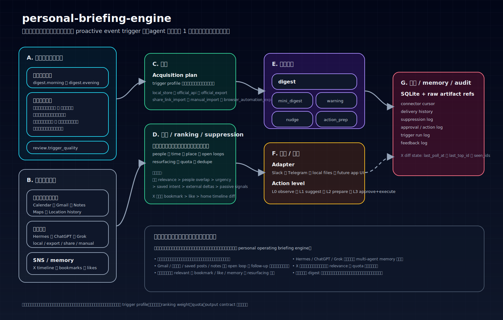

# hermes-briefing-pipeline

日本語版README / [English README](./README.md)

Hermes-first の personal briefing pipeline です。

このリポジトリは、次の 4 ステップを中心に構成します。

1. **Trigger** — cron などのトリガーで実行を開始する
2. **Collect** — そのトリガーに必要な source だけを収集する
3. **Compose** — 文脈を briefing / reply draft / warning / nudge にまとめる
4. **Deliver** — 選んだチャネルへ配信する

現時点での主対象 runtime は **Hermes Agent** です。将来的には OpenClaw、Codex、Claude Code、standalone runtime + skill / MCP へ広げられる余地がありますが、このリポジトリはまず Hermes 向けとして最適化します。

## 全体像

## このリポジトリがやること

これは単なる AI ニュース要約アプリではありません。
Hermes-first で個人向け briefing と proactive 通知を扱うためのパイプラインです。
答えるべき問いは次です。

- 今、何が重要か？
- このあと今日の中で何が重要か？
- 次に会う人について、何を思い出すべきか？
- 外部で何が変わったか、そのうち本当に relevant なのは何か？
- 忘れていたもののうち、今 resurfacing すべきものは何か？
- ユーザーが指示する前に、どの瞬間なら proactive に動く価値があるか？

## コアフロー

runtime としての見え方は、意図的にシンプルです。

### 1. Trigger
定期トリガーも proactive トリガーも、同じパイプラインへ入ります。

例:
- `digest.morning`
- `digest.evening`
- `review.trigger_quality`
- `location.arrival`
- `location.dwell`
- `calendar.leave_now`
- `mail.operational`
- `shopping.replenishment`

### 2. Collect
その trigger profile に必要な source だけを取りに行きます。

source family:
- Calendar / Gmail / email
- Notes / docs
- Maps / saved places
- Location history（たとえば Dawarich）
- Hermes Agent 会話履歴
- ChatGPT / Grok の履歴（local / export / share / manual で取れる範囲）
- X home timeline diff / bookmarks / likes

### 3. Compose
証拠を束ねて、 relevance を順位付けし、ノイズを抑え、適切な出力を作ります。

出力例:
- digest
- mini-digest
- warning
- nudge
- action-prep
- reply draft

優先順位は原則として:
- 未来 relevance
- people overlap
- open loops
- saved intent
- その後に external deltas

X の内部では:
- `bookmark > like > home timeline diff`

### 4. Deliver
選んだ runtime / channel へ配信するか、次の action 準備まで進めます。

初期の配信先:
- Hermes Agent の cron 実行
- Hermes の delivery path を通した Slack / Telegram / local files

## なぜ Hermes-first なのか

この repo は以前、agent-agnostic architecture を前面に出していました。
その portability 自体は残しますが、入口の主語はそこではありません。

現時点の実用上の主対象は:
- **runtime:** Hermes Agent
- **scheduler:** cron ベース
- **形:** trigger → collect → compose → deliver
- **目的:** ユーザーの次の瞬間に実際に役立つ briefing / proactive 通知

## 将来の portability

内部モデルは持ち運べる形を維持します。
将来的には次にも広げられます。
- OpenClaw
- Codex + skill + MCP
- Claude Code + skill + MCP
- standalone daemon / CLI

ただし、それらは今の主訴求ではなく、後続ターゲットです。

## 設計原則

- **Hermes-first runtime target**
- **最小レイヤー**: microservice zoo にしない
- **live retrieval first**
- **単純な canonical data model**
- **import / 非live source に対する強い provenance**
- **user-intent signal は passive signal より強く扱う**
- **LLM は圧縮と説明を担うが、source truth の代替ではない**

## docs 一覧

- [`_docs/README.md`](./_docs/README.md)
- [`_docs/01-product-thesis.md`](./_docs/01-product-thesis.md)
- [`_docs/02-system-architecture.md`](./_docs/02-system-architecture.md)
- [`_docs/03-trigger-model.md`](./_docs/03-trigger-model.md)
- [`_docs/04-collection-and-connectors.md`](./_docs/04-collection-and-connectors.md)
- [`_docs/05-synthesis-ranking-and-suppression.md`](./_docs/05-synthesis-ranking-and-suppression.md)
- [`_docs/06-output-delivery-and-actions.md`](./_docs/06-output-delivery-and-actions.md)
- [`_docs/07-state-memory-and-audit.md`](./_docs/07-state-memory-and-audit.md)
- [`_docs/source-notes/x.md`](./_docs/source-notes/x.md)
- [`_docs/source-notes/conversation-history.md`](./_docs/source-notes/conversation-history.md)
- [`_docs/08-roadmap.md`](./_docs/08-roadmap.md)
- [`_docs/09-migration-from-legacy.md`](./_docs/09-migration-from-legacy.md)
- [`_docs/10-appendix-legacy-research.md`](./_docs/10-appendix-legacy-research.md)

## 現在の状態

このリポジトリは現在、**planning / architecture repo** です。
主に記述しているのは:
- Hermes-first の system model
- source acquisition の制約
- ranking / suppression policy
- delivery / approval のパターン
- state / audit 要件
- 将来の実装ロードマップ

まだ production implementation を主張するものではありません。
