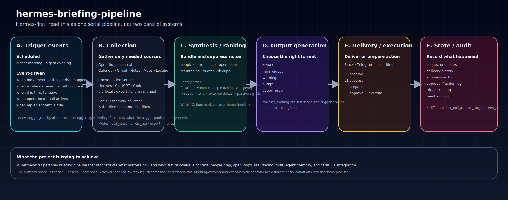

# Hermes Pulse

English README / [日本語版README](./README.ja.md)

Hermes Pulse is a Hermes-first, source-rigorous personal briefing and operating pipeline for scheduled and proactive delivery.

This repository is organized around one practical flow:

1. **Trigger** — cron schedules, feed updates, polling, webhooks, or manual runs start a run
2. **Collect** — fetch only the sources needed for that trigger, preferring primary sources and known-source retrieval before generic web search when possible
3. **Compose** — synthesize context into a briefing, warning, reply draft, expert-depth analysis, or action prep
4. **Deliver** — send the result to the user or prepare the next action through the chosen channel/runtime

Today, the primary target runtime is **Hermes Agent**. The design may later be adapted to standalone runtimes or other agent environments, but this repository optimizes for the Hermes use case first.

## Visual summary

## What this repo does

This is **not** a narrow product for AI news only.
It is a general-purpose operating briefing engine that can go shallow or deep depending on domain, urgency, and user understanding.
It should answer questions like:

- What matters now?
- What matters later today?
- Which incoming changes deserve action rather than passive awareness?
- What should be resurfaced instead of forgotten?
- Which sources are authoritative enough to trust?
- When should the system proactively act before I ask?
- When should the system escalate from a concise note to an expert-depth synthesis?

## Core flow

The runtime-facing flow is intentionally simple.

### 1. Trigger
Scheduled and proactive triggers enter the same pipeline.

Examples:
- `digest.morning`
- `digest.evening`
- `feed.update`
- `calendar.leave_now`
- `mail.operational`
- `location.arrival`
- `shopping.replenishment`
- `review.trigger_quality`

### 2. Collect
Fetch only the sources needed for that trigger profile.

Source families:
- Calendar / Gmail / email
- Notes / docs / local knowledge
- Maps / saved places / location history
- Hermes Agent conversation history
- ChatGPT / Grok history where available through local, export, share, or manual paths
- X bookmarks / likes / reverse chronological home timeline via the official X API path (`xurl`)
- RSS / Atom feeds from official blogs, press rooms, changelogs, research labs, domain media, and specialist third-party blogs
- Known-source registries used as a more reliable retrieval substrate than open web search when possible

Collection policy:
- primary source first
- known-source retrieval before generic search when possible
- secondary/tertiary sources may help discovery, but should resolve back to primary evidence
- preserve provenance and citation chain for every collected item

### 3. Compose
Bundle evidence, rank relevance, suppress spam, and generate the right output type.

Possible outputs:
- digest
- mini_digest
- warning
- nudge
- action_prep
- deep_brief
- source_audit
- reply_draft

Priority should generally remain:
- future relevance
- people overlap
- open loops
- explicit user intent
- source authority and primary confirmation
- then external deltas and passive signals

Within X itself:
- `bookmark > like > reverse chronological home timeline`
- `For You` remains out of scope in v1 because it is recommendation-defined rather than a stable SSOT-grade acquisition surface

### 4. Deliver
Deliver the result or prepare the next action through the chosen runtime/channel.

Initial delivery targets:
- Hermes Agent cron jobs
- Slack / Telegram / local files / email summaries via Hermes delivery paths

## Why Hermes first

This repo used to frame itself mainly as an abstract briefing pipeline.
That portability still matters, but it should not be the main entry point.

For now, the practical target is:
- **runtime:** Hermes Agent
- **scheduler:** cron-based runs and event triggers
- **shape:** trigger → collect → compose → deliver
- **goal:** personal briefings and proactive notifications that actually help in the next moment

## Design principles

- **Hermes-first runtime target**
- **Domain-agnostic, expert-depth capable**
- **Primary-source-first retrieval**
- **Known-source retrieval before generic search when possible**
- **Minimal layers**: one runner, not a microservice zoo
- **Live retrieval first where reality supports it**
- **Simple canonical data model**
- **Strong provenance and citation chains** for imported/non-live sources
- **User-intent signals outrank passive signals**
- **Depth adapts to the user's understanding and the task**
- **LLMs compress and explain; they do not replace source truth**

## Docs index

- [`_docs/README.md`](./_docs/README.md)
- [`_docs/01-product-thesis.md`](./_docs/01-product-thesis.md)
- [`_docs/02-system-architecture.md`](./_docs/02-system-architecture.md)
- [`_docs/03-trigger-model.md`](./_docs/03-trigger-model.md)
- [`_docs/04-collection-and-connectors.md`](./_docs/04-collection-and-connectors.md)
- [`_docs/05-synthesis-ranking-and-suppression.md`](./_docs/05-synthesis-ranking-and-suppression.md)
- [`_docs/06-output-delivery-and-actions.md`](./_docs/06-output-delivery-and-actions.md)
- [`_docs/07-state-memory-and-audit.md`](./_docs/07-state-memory-and-audit.md)
- [`_docs/08-roadmap.md`](./_docs/08-roadmap.md)
- [`_docs/09-migration-from-legacy.md`](./_docs/09-migration-from-legacy.md)
- [`_docs/10-appendix-legacy-research.md`](./_docs/10-appendix-legacy-research.md)
- [`_docs/source-notes/conversation-history.md`](./_docs/source-notes/conversation-history.md)
- [`_docs/source-notes/feeds-and-source-registry.md`](./_docs/source-notes/feeds-and-source-registry.md)
- [`_docs/source-notes/x.md`](./_docs/source-notes/x.md)

## Current repo status

This repository now includes a **minimum executable runtime** for scheduled morning and evening digests.

Implemented today:
- `hermes-pulse morning-digest` CLI entrypoint
- trigger registry for `digest.morning.default`
- trigger registry for `digest.evening.default`
- YAML-backed source registry fixtures
- collection orchestrator with curated connectors
- feed registry connector
- known-source-search connector
- Google Calendar connector
- Gmail connector
- `leave-now-warning` event-trigger CLI
- `mail-operational` event-trigger CLI
- `shopping-replenishment` event-trigger CLI
- `feed-update` event-trigger CLI
- `location-arrival` event-trigger CLI
- `location-walk` event-trigger CLI
- `review-trigger-quality` audit CLI
- `gap-window-mini-digest` event-trigger CLI
- `feed-update-deep-brief` event-trigger CLI
- `feed-update-source-audit` event-trigger CLI
- optional local connectors for Hermes history and notes
- archive writer that persists raw collected items and Codex-facing inputs by date
- Codex CLI summarization path
- local markdown delivery adapter
- Slack direct delivery that converts markdown links into Slack-native links and splits oversized digests into threaded posts
- feed item body enrichment from fetched article pages when the page is available
- optional local SQLite state logging via `--state-db` for trigger runs, deliveries, X-signal connector cursors, and basic observed source-registry state snapshots
- launchd/direct-delivery helpers
- official X API signal connector via `xurl`

Current scope and gaps:
- the runtime is still intentionally small and fixture-friendly
- optional SQLite state wiring now exists for trigger runs, deliveries, delivered-item suppression history (including dismiss / expire / higher-authority supersede transitions), approval/action logs, audit-derived feedback logs, strict action/suppression command validation, structured execution-details persistence, action-execution feedback logging, X-signal connector cursors, source-registry state snapshots (`last_poll_at`, `last_seen_item_ids`, `last_promoted_item_ids`, `authority_tier`), structured source-registry notes including per-source `last_error`, same-trigger suppression filtering for digest delivery, and minimal suppression dismiss/expiry transitions; deeper action execution/feedback loops still remain future work
- legacy local DB/schema compatibility is not preserved intentionally; the runtime now assumes the current schema
- canonical CLI flows today are `morning-digest`, `evening-digest`, `leave-now-warning`, `mail-operational`, `shopping-replenishment`, `feed-update`, `feed-update-deep-brief`, `feed-update-source-audit`, `location-arrival`, `location-walk`, `gap-window-mini-digest`, and `review-trigger-quality`
- `calendar.leave_now`, `calendar.gap_window`, `mail.operational`, `shopping.replenishment`, `feed.update`, `feed.update.expert_depth`, `feed.update.source_audit`, `location.arrival`, `location.walk`, and `review.trigger_quality` are implemented minimally; deeper trigger families still remain future work
- the intended high-frequency location shape is a narrow `location.walk` poll (for example every 5 minutes) against a local-store source such as Dawarich, with cooldown/suppression used to avoid spam
- docs still describe broader target architecture beyond the currently implemented runtime

Verification snapshot:
- `pytest -q` → passing
- current local test suite covers CLI, models, registries, collection, Calendar/Gmail/location/audit connectors, event-trigger rendering including deep brief/source audit paths, delivery, launchd integration, and the `xurl` connector
